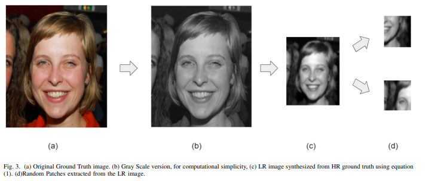
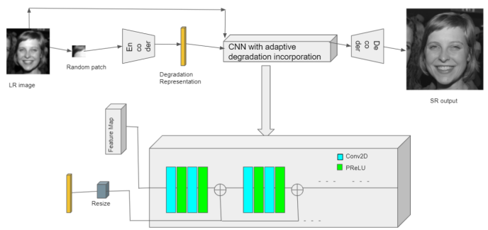
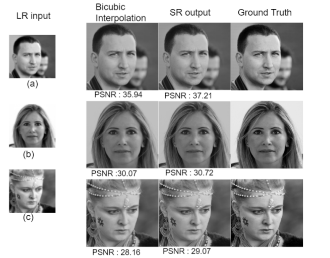

# IIST_Final_Year_Project
# Extracting Abstract Degradation Representation through Contrastive Learning for Blind Super-Resolution and Denoising

## Introduction
This project aims to explore a novel approach toward degradation learning in blind super-resolution and denoising tasks using contrastive learning techniques. By extracting an abstract representation of degradation from low-resolution (LR) images, we seek to enhance the quality of these images without relying on predefined degradation models. This method not only simplifies the learning process but also improves efficiency, providing a significant advancement in the field of single image super-resolution (SISR).

## Theory
Contrastive learning has emerged as a powerful technique for representation learning, allowing models to learn effective embeddings without direct supervision. In this project, we investigate the possibility of extracting abstract degradation representations from images. Instead of estimating degradation from LR images, we focus on distinguishing latent degradation characteristics across images.

This abstract degradation representation is utilized to super-resolve LR images, circumventing the need for direct supervision. By learning a more compact and meaningful representation of degradation, we aim to achieve better performance in SISR tasks while minimizing computational overhead.

## Objectives
- Develop a method for extracting abstract degradation representations from LR images using contrastive learning.
- Implement a robust super-resolution model that leverages the extracted degradation representations.
- Evaluate the model's performance using metrics such as Mean Squared Error (MSE) and visual inspections of reconstructed images.
- Provide a comprehensive pipeline to automate data preprocessing, model training, and evaluation processes.

## Model Design
The model consists of the following components:
- **Degradation Encoder**: This component extracts the abstract degradation representation from LR images.
- **Super-Resolution Generator**: Utilizes the extracted degradation representation to enhance the quality of LR images.
- **Loss Function**: A contrastive loss function is employed to ensure effective representation learning.
- **Optimizer**: Stochastic Gradient Descent (SGD) is used to update model weights during training.

## Environment Specifications
This project is designed to run on Linux operating systems. The required environment specifications are as follows:
1. Python: 3.5+
2. PyTorch: 0.1.8
3. OpenCV
4. scikit-image
5. NumPy
6. Matplotlib
7. imageio
8. SciPy

## Project Structure
This repository contains three versions of the project:
1. **Built_from_Scratch.ipynb**: The original low utility version of the project, showcasing fundamental concepts.
2. **Moco-version**: The implementation of the original Degradation-Aware Super Resolution (DASR) network.
3. **SimCLR-version**: An enhanced version that incorporates improvements over existing methods using SimCLR techniques.

## Scripts Overview
### `dataset.py`
This script handles the loading of training and testing datasets from the specified directory, preparing the images for further processing.

### `preprocess.py`
This script performs preprocessing tasks on the images, including resizing and normalization. It also generates training labels based on random binary arrays to simulate degradation.

### `model.py`
This script defines and compiles the model architecture for both the degradation encoder and the super-resolution generator, setting up training parameters.

### `train.py`
This script manages the training process of the model, visualizing the training loss and performance metrics to provide insights during training.

### `test.py`
This script evaluates the trained model on the test dataset, reconstructing LR images and visualizing the results for comparison against the original images.

### `pipeline.py`
This script orchestrates the end-to-end process, integrating data loading, preprocessing, model training, and evaluation into a streamlined workflow.

### `main.py`
This is the entry point of the project, allowing users to run the entire pipeline by providing the dataset path as a command-line argument.

## Results

## Conclusion
This project demonstrates the potential of leveraging contrastive learning techniques for extracting abstract degradation representations in blind super-resolution and denoising tasks. By reducing reliance on direct supervision and focusing on efficient representation learning, we aim to improve the performance of single image super-resolution methods, thereby enhancing image quality for various applications.

